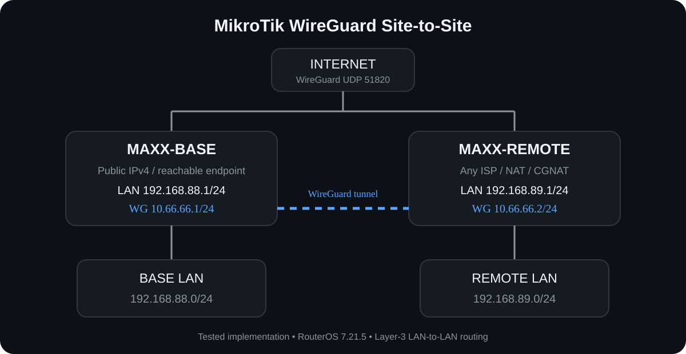

# MikroTik WireGuard Site-to-Site VPN

[](https://mikrotik.com/)


A tested **site-to-site WireGuard VPN** between two MikroTik routers, providing bidirectional Layer-3 connectivity between two remote LAN networks over the Internet.

The BASE site is reachable through a public IPv4 address, while the REMOTE site can operate behind NAT/CGNAT using a regular ISP, Starlink, or another Internet connection.

---

## Network Topology



The WireGuard tunnel connects two independent LAN networks:

```text
BASE LAN                                  REMOTE LAN
192.168.88.0/24                           192.168.89.0/24
       │                                         │
       ▼                                         ▼
   MAXX-BASE                                 MAXX-REMOTE
 192.168.88.1                               192.168.89.1
  10.66.66.1                                 10.66.66.2
       │                                         │
       └──────── WireGuard UDP 51820 ────────────┘
```

---

## Project Goal

The goal of this project is to create a simple and reliable connection between two geographically separated MikroTik networks.

Devices on either LAN can communicate with devices on the opposite LAN as if the routers were connected through a private routed network.

Example:

```text
192.168.88.x  ↔  192.168.89.x
```

The WireGuard tunnel is used only for traffic between the remote networks, while both routers retain their normal Internet connectivity.

---

## Addressing

| Component | Address |
|---|---|
| BASE LAN | `192.168.88.0/24` |
| BASE router | `192.168.88.1` |
| REMOTE LAN | `192.168.89.0/24` |
| REMOTE router | `192.168.89.1` |
| WireGuard network | `10.66.66.0/24` |
| BASE WireGuard | `10.66.66.1` |
| REMOTE WireGuard | `10.66.66.2` |
| WireGuard port | `UDP 51820` |

### DHCP

```text
BASE
192.168.88.100 - 192.168.88.200

REMOTE
192.168.89.100 - 192.168.89.200
```

---

## How It Works

### BASE

The BASE router acts as the reachable WireGuard endpoint.

```text
LAN:       192.168.88.0/24
Router:    192.168.88.1
WireGuard: 10.66.66.1
Port:      UDP 51820
```

The BASE side must be reachable from the Internet using a public IPv4 address or an equivalent upstream port-forwarding configuration.

### REMOTE

The REMOTE router initiates the WireGuard connection toward BASE.

```text
LAN:       192.168.89.0/24
Router:    192.168.89.1
WireGuard: 10.66.66.2
Keepalive: 25 seconds
```

Because REMOTE initiates the tunnel, it can operate behind NAT/CGNAT.

---

## Routing

The WireGuard tunnel provides transport between:

```text
10.66.66.1 ↔ 10.66.66.2
```

Static routes provide access to the remote LAN networks.

### BASE

```text
192.168.89.0/24 → 10.66.66.2
```

### REMOTE

```text
192.168.88.0/24 → 10.66.66.1
```

Result:

```text
192.168.88.0/24
        │
        ▼
    MAXX-BASE
    10.66.66.1
        │
        │
     WireGuard
        │
        │
    10.66.66.2
   MAXX-REMOTE
        │
        ▼
192.168.89.0/24
```

---

## Verified

This configuration was built and tested on physical MikroTik routers.

- [x] BASE Internet connectivity
- [x] REMOTE Internet connectivity
- [x] WireGuard handshake
- [x] Tunnel IP connectivity
- [x] BASE → REMOTE routing
- [x] REMOTE → BASE routing
- [x] BASE LAN → REMOTE LAN
- [x] REMOTE LAN → BASE LAN
- [x] DHCP on both LANs
- [x] Internet access retained on both sites

A REMOTE LAN test client received:

```text
IPv4:    192.168.89.200
Mask:    255.255.255.0
Gateway: 192.168.89.1
```

and successfully reached:

```text
192.168.88.1
```

through the WireGuard tunnel with **0% packet loss** during the test.

---

## Hardware & Software

Tested with:

```text
Router:   MikroTik RB951Ui-2nD
RouterOS: 7.21.5
VPN:      WireGuard
MTU:      1420
```

The configuration should also work on other MikroTik devices running RouterOS 7 with WireGuard support.

---

## Repository Structure

```text
mikrotik-wireguard-site-to-site/
│
├── README.md
│
├── configs/
│   ├── MAXX-BASE.example.rsc
│   └── MAXX-REMOTE.example.rsc
│
├── docs/
│   ├── SETUP.md
│   └── TESTING.md
│
└── images/
    └── network-topology.svg
```

---

## Configuration Files

Ready-to-adapt RouterOS configuration examples are available in:

### BASE

[`configs/MAXX-BASE.example.rsc`](configs/MAXX-BASE.example.rsc)

### REMOTE

[`configs/MAXX-REMOTE.example.rsc`](configs/MAXX-REMOTE.example.rsc)

Before using the templates, replace:

```text
<BASE_PUBLIC_IP>
<BASE_PUBLIC_KEY>
<REMOTE_PUBLIC_KEY>
```

with values from your own network.

> Never publish or share WireGuard private keys.

---

## Setup

A complete step-by-step configuration guide is available here:

**[Setup Guide →](docs/SETUP.md)**

It covers:

- LAN bridge configuration
- DHCP
- WAN
- NAT
- WireGuard interfaces
- WireGuard peers
- tunnel addressing
- static routing
- handshake verification
- LAN-to-LAN testing

---

## Testing

After configuration, follow:

**[Testing Checklist →](docs/TESTING.md)**

Testing is performed progressively:

```text
Internet
   ↓
WireGuard handshake
   ↓
10.66.66.1 ↔ 10.66.66.2
   ↓
Router-to-router
   ↓
LAN-to-LAN
   ↓
End devices
```

This makes it easier to identify which network layer is causing a problem.

---

## Security

The configuration examples in this repository are sanitized.

They do **not** contain:

- WireGuard private keys
- real public endpoint IP addresses
- router serial numbers
- RouterOS software IDs
- passwords

For an Internet-facing deployment, review your RouterOS firewall configuration and permit only the services that are actually required.

---

## Status

**Tested and operational.**

```text
BASE LAN
192.168.88.0/24
      │
      │
      ╞════════ WireGuard ════════╡
      │
      │
REMOTE LAN
192.168.89.0/24

          CONNECTED
```

---

## Author

**bmax-sys**

Embedded systems • Networking • Robotics
